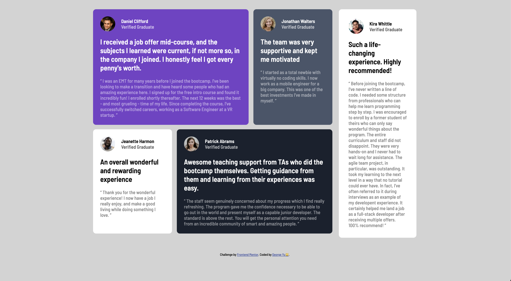

# Frontend Mentor - Testimonials grid section solution

This is a solution to the [Testimonials grid section challenge on Frontend Mentor](https://www.frontendmentor.io/challenges/testimonials-grid-section-Nnw6J7Un7). Frontend Mentor challenges help you improve your coding skills by building realistic projects. 

## Table of contents

- [Overview](#overview)
  - [Screenshot](#screenshot)
  - [Links](#links)
- [My process](#my-process)
  - [Built with](#built-with)
  - [What I learned](#what-i-learned)
- [Author](#author)

## Overview

### Screenshot




### Links

- Live Site URL: [Github Page](https://yubaichuan2000.github.io/testimonials-grid-section/)

## My process

### Built with

- Semantic HTML5 markup
- CSS custom properties
- Flexbox
- Mobile-first workflow

### What I learned

- CSS Flexbox to arrange elements and manage layouts
- Responsive design with mobile-first workflow using media query
- Create circular profile images

```css
.circle-img {
    width: 50px;
    height: 50px; 
    border-radius: 50%;
    overflow: hidden;
}
```

## Author

- Reach out to me on Linkedin - [George Yu](https://www.linkedin.com/in/george-yu-a6800a227/)